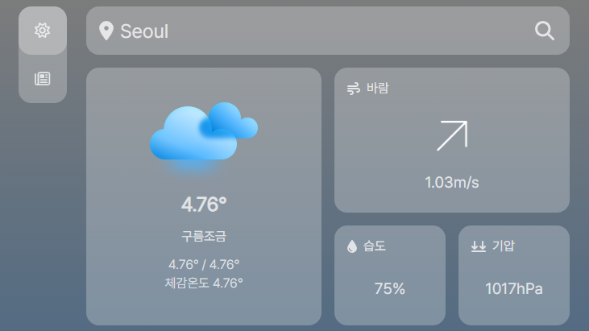
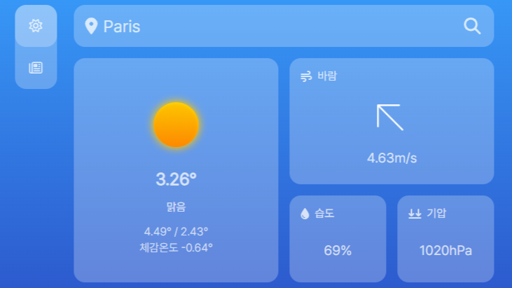
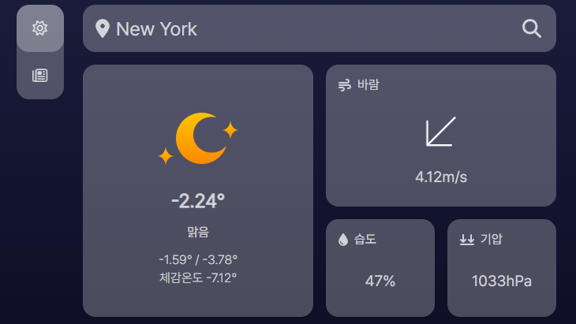
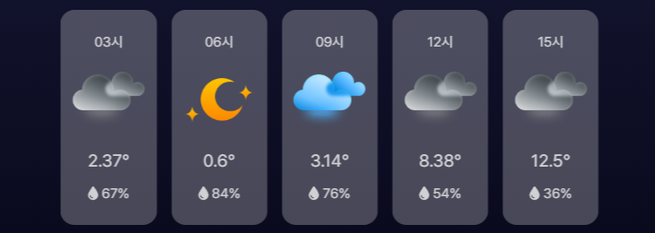
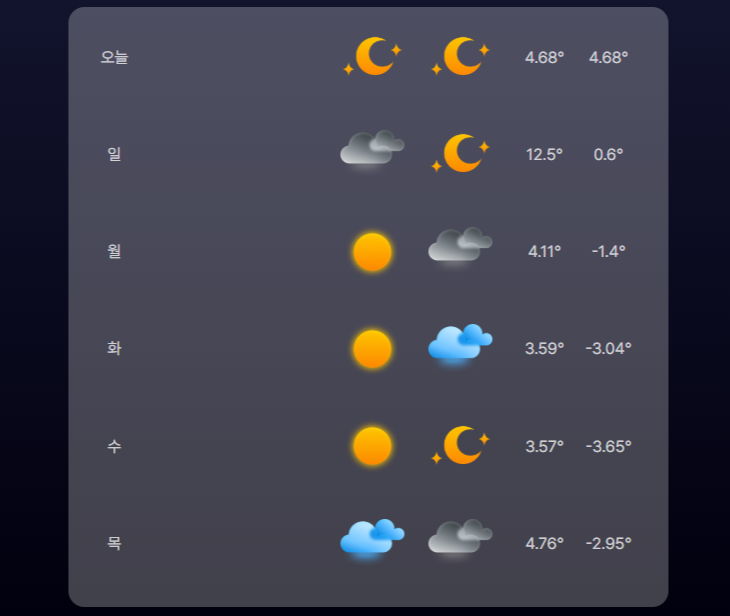
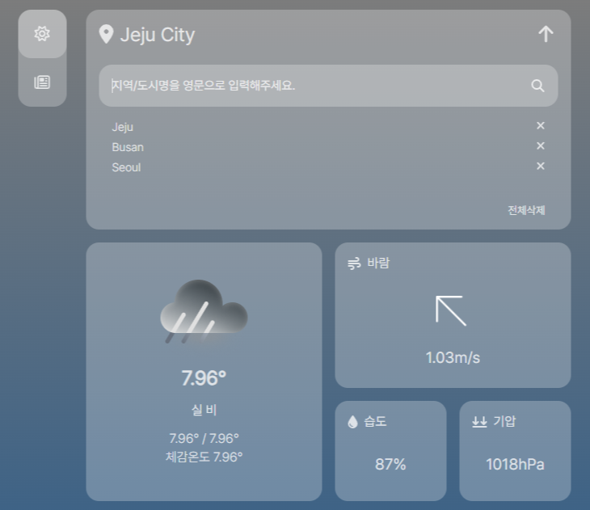
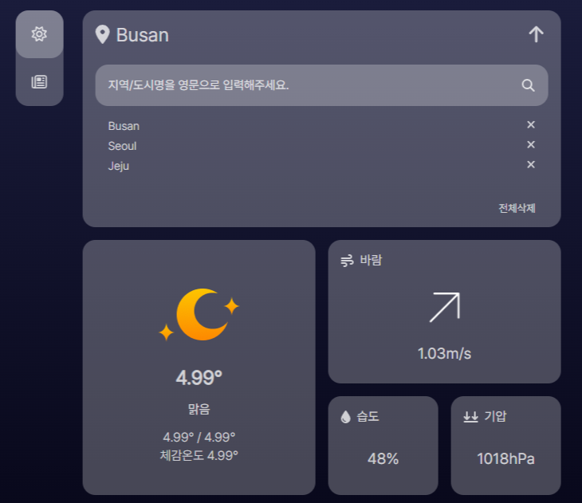

# Today's Weather & News

Open Weather API와 News Data API를 활용하여 제작한 반응형 웹 페이지

 

## 개요

### 📅 기간

2024.02.10(월) - 2024.02.14(금)

### 🛠️ 사용 기술

- React.js
- React Query
- Redux Toolkit

 

## 화면 소개

- 현재 날씨 상태와 온도, 습도, 풍속 등 기본 정보 표시
  
  화면의 최상단에 적혀있는 현재 지역의 왼쪽에 있는는 버튼을 클릭하면 현재 나의 위치에 해당하는 지역의 날씨를 볼 수 있고, 오른쪽 버튼을 클릭하면 검색창이 나타남

  

- 날씨 상태나 시간에 따라 달라지는 배경색

  __낮__

  

  __밤__

  

  __흐릴 때__

  

- 3시간 간격의 날씨 정보 표시

  

- 5-6일간의 요일 별 날씨 정보 표시

  

- 원하는 지역의 날씨를 검색할 수 있는 검색창

  - 검색어를 입력하고 버튼을 누르거나 키보드의 엔터키를 누르면 해당 지역의 날씨 정보가 뜨고, 검색창 하단에 최근 검색어 기록에 검색한 지역이 추가됨
  - 최근 검색어를 클릭하면 해당 지역의 날씨를 볼 수 있고, 검색어 옆의 X 버튼을 누르면 해당 검색어가 삭제됨
  - 전체삭제 버튼을 누르면 최근 검색 기록을 모두 지울 수 있음

  

  

- 뉴스 페이지

  화면 제일 왼쪽의 메뉴바를 통해 뉴스 페이지로 이동할 수 있음

  

 